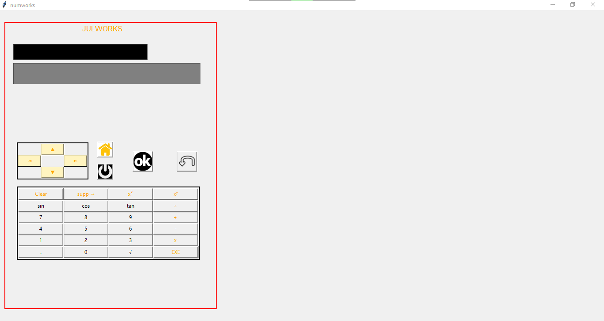

# Julworks Calculator

This is a simple calculator application developed in Python using the Tkinter library. It provides basic arithmetic operations along with trigonometric functions such as sine, cosine, and tangent. Additionally, it allows users to navigate through the input field using arrow buttons.

## Features

- **Arithmetic Operations**: Addition (+), subtraction (-), multiplication (*), and division (/).
- **Exponential Operations**: The calculator supports exponential operations such as raising a number to a power (x^y).
- **Trigonometric Functions**: Users can calculate sine, cosine, and tangent of angles specified in degrees.
- **Square Root Calculation**: It offers a square root function for calculating the square root of a number.
- **History Display**: The calculator displays a history of previous calculations, allowing users to review their recent inputs and results.
- **Cursor Navigation**: Users can navigate within the input field using arrow buttons (up, down, left, right).
- **Clear and Delete Functionality**: It provides options to clear the input field completely or delete the last entered character.

## Button Functions

- **Clear (Clear)**: Clears the input field, allowing users to start a new calculation.
- **Delete (Supp →)**: Deletes the last entered character from the input field.
- **Square (x²)**: Raises the current value displayed in the input field to the power of 2.
- **Exponential (xʸ)**: Allows users to enter an exponential expression. For example, entering "2" then pressing this button followed by "3" will calculate 2^3.
- **Sine (sin)**: Calculates the sine of the angle specified in degrees.
- **Cosine (cos)**: Calculates the cosine of the angle specified in degrees.
- **Tangent (tan)**: Calculates the tangent of the angle specified in degrees.
- **Division (÷)**: Performs division operation.
- **Number Buttons (0-9)**: Enters the corresponding number into the input field.
- **Decimal Point (.):** Adds a decimal point to the current number for decimal input.
- **Square Root (√)**: Calculates the square root of the current number.
- **Execute (EXE)**: Calculates the result of the expression entered in the input field.
- **Addition (+)**: Performs addition operation.
- **Subtraction (-)**: Performs subtraction operation.
- **Multiplication (x)**: Performs multiplication operation.

## Screenshots



## Usage

To run the calculator, execute the Python script `calculette.py`. The graphical user interface will appear, allowing you to perform calculations and navigate through the input field.

## Requirements

- Python 3.x
- Tkinter
- PIL (Python Imaging Library)

## Installation

You can clone this repository to your local machine using:

```bash
git clone https://github.com/julienheinen/calculator.git
```

## Contributing

Contributions are welcome! Feel free to open an issue or submit a pull request for any enhancements or bug fixes.

## License

This project is licensed under the MIT License - see the [LICENSE](LICENSE) file for details.